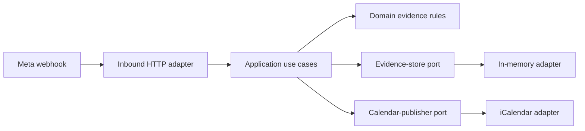

# WhatsApp Context Bridge

A consent-first, evidence-preserving bridge from WhatsApp messages to reviewable
calendar facts. The first vertical slice recognizes explicit birthday statements,
holds them for human approval, and publishes an annual iCalendar file only after
confirmation.

The interesting idea is not “put an LLM in WhatsApp.” It is a smaller claim:
automation may propose a fact, but evidence and a human decision remain attached
to every consequential write.

This integrates with the WhatsApp **Business** Platform and receives new messages
sent to its configured business number. It does not read an ordinary personal
WhatsApp account or silently import its history. Exported-chat ingestion belongs in
a separate, explicitly initiated offline adapter.

For personal messaging, the same core also exposes a signed device-relay boundary.
On Android, a future companion can relay consented SMS records or visible
notifications without pretending Spectrum exposes a message API. For personal
WhatsApp, the defensible sources are a user-initiated chat export or future visible
notifications; neither is equivalent to a complete live WhatsApp API.

## Architecture



Dependencies point inward. The core knows nothing about HTTP, Meta, filesystems,
or future Microsoft Graph and OpenAI adapters. See [the architecture decision](docs/adr/0001-hexagonal-evidence-first.md).

## Run locally

Requirements: Node.js 22+ and npm.

```bash
npm install
cp .env.example ~/.env
chmod 600 ~/.env
# Replace placeholder values in ~/.env.
npm run dev
```

The application reads only named keys from `~/.env`. It intentionally does not
load a repository-local `.env` file.

Create independent random values rather than reusing passwords:

```bash
openssl rand -hex 32
```

Endpoints:

- `GET /healthz`
- `GET /webhooks/whatsapp` — Meta webhook challenge
- `POST /webhooks/whatsapp` — signed Meta webhook payload
- `POST /webhooks/device` — signed, five-minute-window personal Android relay
- `GET /candidates` — bearer-token-protected review queue
- `POST /candidates/{id}/confirm` — bearer-token-protected calendar publication

The default outbound adapter logs a redacted review notification. Set
`OUTBOUND_MODE=whatsapp` only after configuring a dedicated WhatsApp Business
number and reviewing Meta's current policies.

## Quality gates

```bash
npm run check
npm run mutation       # deeper, intentionally slower test-quality check
```

The suite is classified in [docs/testing.md](docs/testing.md). Coverage is a
signal, not a proof; mutation testing probes whether assertions can detect changed
behavior.

## Public-data boundary

Never commit exported chats, phone numbers, access tokens, `.ics` outputs, or real
webhook payloads. Generated calendar artifacts live under ignored `data/`.
`npm run public-safety` provides a fast pre-push tripwire; it is not a substitute
for repository-history scanning or disciplined review.

## Status

This is an executable reference slice, not yet a hosted product. The next safe
steps are documented in [ROADMAP.md](ROADMAP.md).

## Primary references

- [Meta WhatsApp webhook endpoint](https://developers.facebook.com/documentation/business-messaging/whatsapp/webhooks/create-webhook-endpoint/)
- [Meta message webhook shape](https://developers.facebook.com/documentation/business-messaging/whatsapp/webhooks/reference/messages)
- [WhatsApp chat export](https://faq.whatsapp.com/1180414079177245)
- [Android SMS provider](https://developer.android.com/reference/android/provider/Telephony.Sms)
- [Android user-mediated send intent](https://developer.android.com/reference/android/content/Intent#ACTION_SENDTO)
